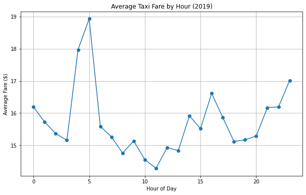

# NYC Taxi Data Analysis with PySpark
Analyzes 2019 NYC Yellow Taxi data using PySpark on Databricks Community Edition.

## Goal
Explore trip patterns (e.g., fares by hour) with big data tools.

## Dataset
- Source: [NYC TLC Trip Data](https://www.nyc.gov/site/tlc/about/tlc-trip-record-data.page)
- File: January 2019 Yellow Taxi Trip Records (Parquet, sampled to ~70,000 rows)

## How to Run
1. Sign up for [Databricks Community](https://community.cloud.databricks.com/).
2. Upload the dataset to DBFS.
3. Import `NYC_Taxi_Analysis.ipynb` and run on a free cluster.

## Results

## Tools
- PySpark
- Databricks Community Edition
- Matplotlib
